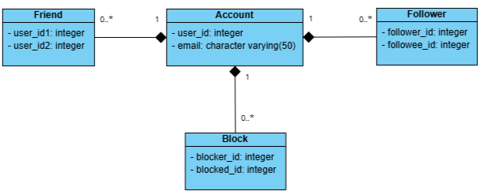

# Friends Management API

## 1. Objective
To design, develop, and deliver an API that enables management of friend connections, subscriptions, blocks, and update notifications between users identified by email addresses.

## 2. Scope of Work
Project API features:

1. **Create a friend connection between two email addresses.**  
   - **API name**: /friend/connect  
   - **Method**: POST  
   - **Description**: User A adds user B as a friend  
      - **Note**: friends can see each other's updates  
   - **JSON request**:  
     ```json
     { 
         "friends": 
         [ 
               "andy@example.com", 
               "john@example.com" 
         ] 
     }
     ```  
   - **Response**:  

     ```json
     { 
         "success": true 
     }
     ```  


2. **Retrieve the friends list for an email address.**  
   - **API name**: /friend/list
   - **Method**: POST  
   - **Description**: User A gets list of all friends  
   - **JSON request**:  
     ```json
     {   
         "email": "andy@example.com"  
     }
     ```  
   - **Response**:  

     ```json
     {   
         "success": true, 
         "friends": 
         [ 
               "john@example.com" 
         ],    
         "count": 1 
     }
     ```

3. **Retrieve common friends list between two email addresses.**  
   - **API name**: /friend/common
   - **Method**: POST  
   - **Description**: User A gets list of mutual friends with user B  
   - **JSON request**:  
     ```json
     { 
         "friends": 
         [ 
               "andy@example.com", 
               "john@example.com" 
         ] 
     }
     ```  
   - **Response**:  

     ```json
     {   
         "success": true, 
         "friends": 
         [ 
               "common@example.com" 
         ], 
         "count": 1 
     }
     ```


4. **Subscribe to updates from another email address.**  
   - **API name**: /follow/subscribe 
   - **Method**: POST  
   - **Description**: User A follows user B for updates
      - **Note**: Following does not add as friend  
   - **JSON request**:  
     ```json
     { 
         "requestor": "lisa@example.com", 
         "target": "john@example.com" 
     }
     ```  
   - **Response**:  

     ```json
     { 
         "success": true 
     }
     ```

5. **Block updates from another email address.**  
   - **API name**: /block/block
   - **Method**: POST  
   - **Description**: User A blocks user B
      - **Note**: If user B follows user A, they are removed. They cannot follow or add each other as friends.
   - **JSON request**:  
     ```json
     { 
         "requestor": "andy@example.com", 
         "target": "john@example.com" 
     }
     ```  
   - **Response**:  

     ```json
     { 
         "success": true 
     }
     ```

6. **Retrieve all update recipients for an email address.**  
   - **API name**: /post  
   - **Method**: POST  
   - **Description**: User A gets list of recipients of user A's updates
      - **Note**: Recipents include user A's friends, followers and users @mentioned in the update **that has not blocked A** 
   - **JSON request**:  
     ```json
     { 
         "sender": "john@example.com", 
         "text": "Hello! kate@example.com" 
     }
     ```  
   - **Response**:  

     ```json
     { 
         "success": true, 
         "recipients": 
         [ 
               "lisa@example.com", 
               "kate@example.com" 
         ] 
     }
     ```

   

## 3. Database Design
The system will use a relational database with the following core tables:  
- **Account** (stores unique user email addresses)  
- **Friend** (friendship relationships)  
- **Follower** (follow relationships)  
- **Block** (blocking relationships)  

**Database ER Diagram**  


SQL Script to recreate the database: [frienddb.sql](./sql/frienddb.sql)

## 4. API Testing
Use the included Postman collection to test the API endpoints with the predefined requests. Postman collection: [op_friend_management.postman_collection.json](./postman/op_friend_management.postman_collection.json)

## 5. Time Frames
- **Time Frame**: 2 Weeks
- **Start date**: 06 April, 2026

## 6. Technical Specifications
- **Architecture:** RESTful API.
- **Data Format:** JSON for all requests and responses.
- **Persistence:** Relational database (PostgreSQL).
- **Frameworks:** Sails.js (Node.js).
- **Error Handling:** Standard HTTP status codes and error messages.
- **Security:** Input validation, prevention of duplicate connections, and blocking logic enforcement.
